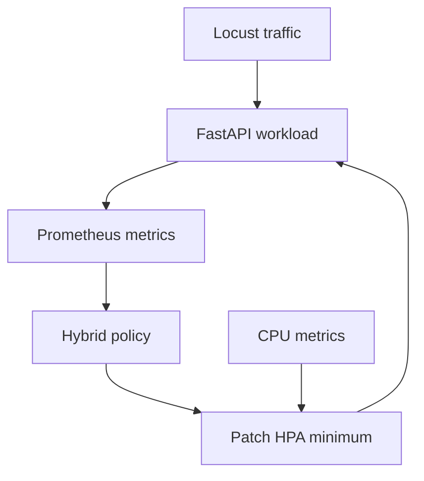

# Lightweight Hybrid Autoscaler for Kubernetes

A reproducible portfolio implementation that compares Kubernetes' CPU-based Horizontal Pod Autoscaler (HPA) with a lightweight hybrid policy using request rate, short-term traffic trend, latency, and warm-pod logic.

> Status: the implementation and experiment harness are ready. The recovered historical run is not published because every saved Locust request failed and neither test scaled above one replica. Run the controlled benchmark below before reporting a performance improvement.

## Problem

CPU-based HPA is reactive: resource utilization must rise and be observed before replicas change. For low-traffic services with sudden spikes, that delay can increase latency while new pods become ready. This project tests whether a small predictive signal can raise the HPA minimum earlier without permanently overprovisioning the workload.

## Design



The hybrid controller does not fight the HPA by directly scaling the Deployment. It adjusts `minReplicas`; HPA remains responsible for CPU-based scaling above that floor.

## What is included

- Instrumented FastAPI application and non-root Docker image
- Kubernetes Deployment, Service, HPA, and ServiceMonitor manifests
- Hybrid policy with testable decision logic
- Locust traffic profile
- Preflight checks that stop tests when the app, cluster, or Prometheus is unavailable
- Baseline/hybrid experiment runner using identical workloads
- Result validator that refuses to report runs with failures or missing scale events
- Clearly labeled presentation-expected and simulated examples kept separate from measured results
- Unit tests and GitHub Actions validation

## Repository structure

```text
app/          Workload service, metrics, and Dockerfile
controller/   Hybrid policy and controller
k8s/          Kubernetes and Prometheus discovery manifests
loadtest/     Locust workload
scripts/      Preflight, experiment, logging, and analysis tools
tests/        Policy and result-validation tests
results/      Measured outputs plus separately labeled simulated examples
docs/         Research and portfolio notes
```

## Prerequisites

- Docker Desktop
- Minikube
- kubectl
- Helm
- Python 3.11+

## 1. Create the cluster and monitoring stack

```powershell
minikube start --cpus=4 --memory=6144
minikube addons enable metrics-server
helm repo add prometheus-community https://prometheus-community.github.io/helm-charts
helm repo update
helm upgrade --install monitoring prometheus-community/kube-prometheus-stack --namespace monitoring --create-namespace --set prometheus.prometheusSpec.serviceMonitorSelectorNilUsesHelmValues=false
```

## 2. Build and deploy

```powershell
minikube image build -t hybrid-demo-app:local ./app
kubectl apply -f k8s/namespace.yaml
kubectl apply -f k8s/app.yaml
kubectl apply -f k8s/hpa.yaml
kubectl apply -f k8s/service-monitor.yaml
kubectl wait --for=condition=available deployment/hybrid-demo-app -n autoscaler-demo --timeout=180s
```

## 3. Install the local experiment tools

```powershell
python -m venv .venv
.\.venv\Scripts\Activate.ps1
pip install -r requirements-dev.txt
python -m unittest discover -s tests -v
```

## 4. Open two PowerShell terminals

Terminal 1 - application:

```powershell
kubectl port-forward service/hybrid-demo-service 8000:8000 -n autoscaler-demo
```

Terminal 2 - Prometheus:

```powershell
kubectl port-forward service/monitoring-kube-prometheus-prometheus 9090:9090 -n monitoring
```

## 5. Validate, then run identical experiments

```powershell
python scripts/preflight.py
python scripts/run_experiment.py baseline
python scripts/run_experiment.py hybrid
python scripts/analyze_results.py
```

Each run resets the Deployment and HPA, verifies readiness, uses the same Locust user/spawn/duration configuration, and records desired and ready replicas every two seconds.

## Valid evidence rules

The analysis fails instead of producing a success claim when:

- Any run has more than 1% failed requests
- Either run never reaches more than one ready replica
- The workload settings differ
- Required result files are missing

When both runs are valid, `results/validated_metrics.json` contains the measured reaction times and computed improvement ratio. Use only those values in your resume.

## Resume wording before rerunning

**Designed a lightweight hybrid Kubernetes autoscaler using request-rate trends, latency signals, warm-pod logic, Prometheus, and Locust to evaluate proactive scaling against CPU-based HPA.**

After a valid run, replace this with a quantified bullet using `validated_metrics.json`.

## Recovered-project audit

The original source code was useful and has been preserved conceptually. Historical output was excluded from the portfolio because it recorded 100% Locust failures, roughly 4.09-second failed responses, and a constant replica count of one for both modes. This rebuilt harness prevents those outputs from being misinterpreted as a performance result.

The `results/simulated_examples/` folder preserves presentation-expected metrics and illustrative replica timelines for explanation only. Every row is labeled as expected or simulated; these files are not accepted by the validation script and must not be presented as measured output.

## References

- [Kubernetes HPA walkthrough](https://kubernetes.io/docs/tasks/run-application/horizontal-pod-autoscale-walkthrough/)
- [Prometheus Community Helm charts](https://github.com/prometheus-community/helm-charts)

## License

MIT
